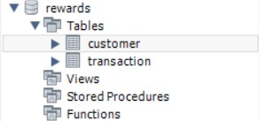
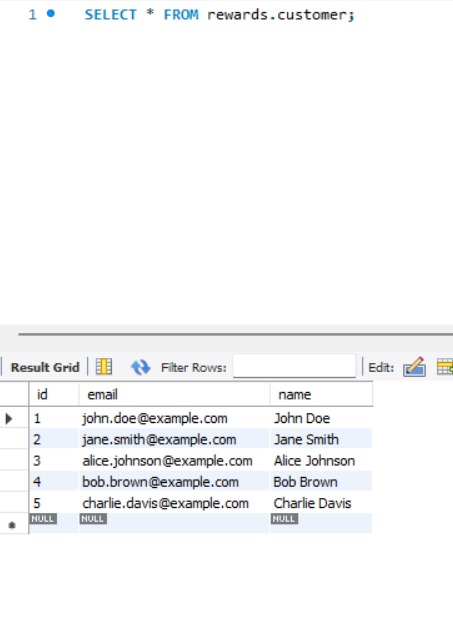
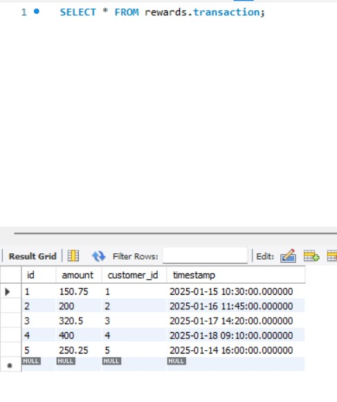

### Overview

The Rewards API is a Spring Boot application designed to calculate reward points for customers based on their transactions. The reward points are calculated as follows:

2 points for every dollar spent over $100 in a single transaction.

1 point for every dollar spent between $50 and $100 in a single transaction.

Transactions below $50 do not earn any points.

The application provides a RESTful API to calculate rewards for a given customer over a specified time frame.

### Features

## Reward Points Calculation:

Calculates rewards for a specific customer over a customizable time frame.

## Dynamic and Scalable API:

Allows users to provide a time frame dynamically for reward calculations.

## Detailed Responses:

API responses include customer information and transaction details.

### Testing:

JUnit test cases cover multiple scenarios.

### API Endpoints

Calculate Rewards for a Customer

### Endpoint: /api/rewards

### Method: POST

### Request Body:

{
  "customerId": 123,
  "startDate": "2023-10-01T00:00:00",
  "endDate": "2023-12-31T23:59:59"
}

### Response:

{
  "customerId": 123,
  "monthlyPoints": {
    "October": 150,
    "November": 200,
    "December": 100
  },
  "totalPoints": 450,
  "transactions": [
    {
      "transactionId": 1,
      "amount": 120.0,
      "date": "2023-10-15T10:00:00"
    },
    {
      "transactionId": 2,
      "amount": 80.0,
      "date": "2023-11-20T14:30:00"
    }
  ]
}

Calculate Rewards for a Customer (By Month)

### Endpoint: /api/rewards/{year}/{month}
### Method: GET
### Path Variables:

year: The year for which rewards are calculated.
month: The month for which rewards are calculated.

### Request Body:

{
  "customerId": 123
}

### Response:

{
  "customerId": 123,
  "monthlyPoints": {
    "November": 200
  },
  "totalPoints": 200,
  "transactions": [
    {
      "transactionId": 3,
      "amount": 150.0,
      "date": "2023-11-05T12:00:00"
    }
  ]
}

### Setup Instructions

Clone the repository from GitHub:

git clone <repository_url>

### Build the project:

cd Rewards-API-backend

./gradlew build

### Run the application:

./gradlew bootRun

### Test endpoints using a tool like Postman.

### Testing

## Run unit tests using:

./gradlew test

. There is also a UI developed which will test REST API endpoint you need to provide details such as customer ID and the date range

. Validation is also performed for these fields.

## Database

